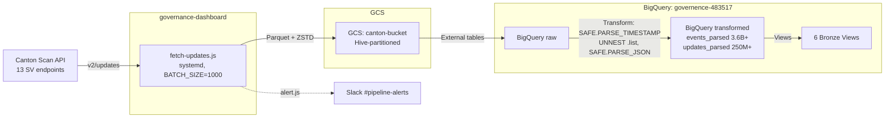
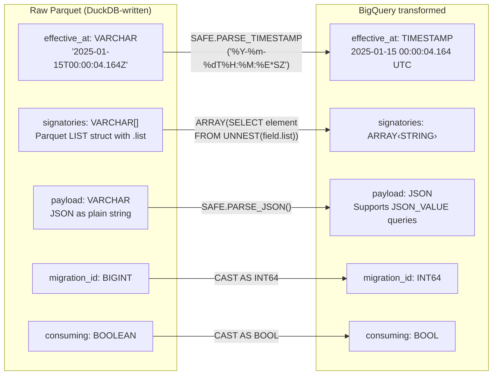
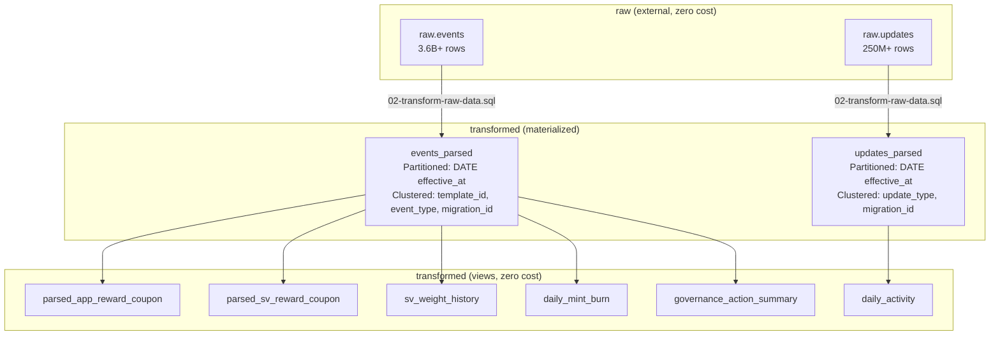
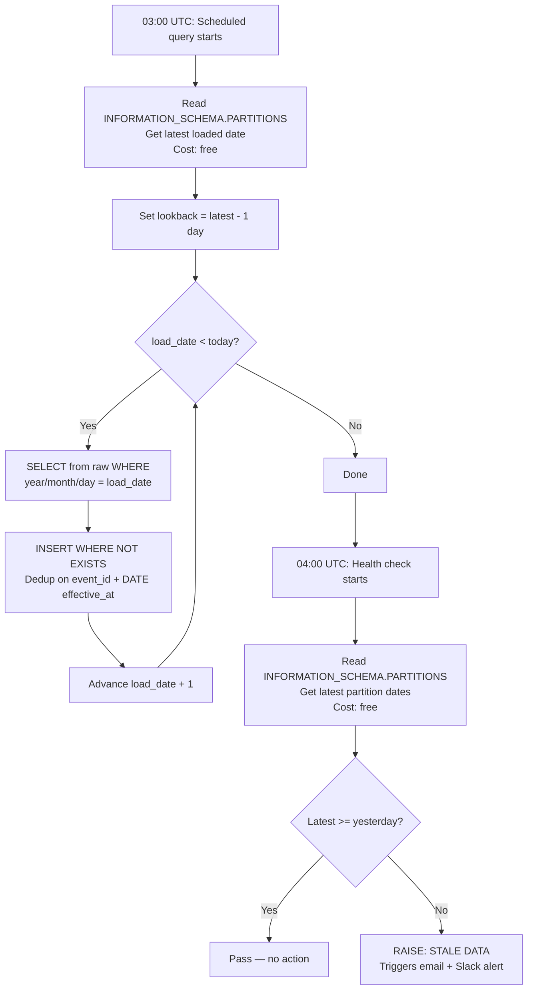
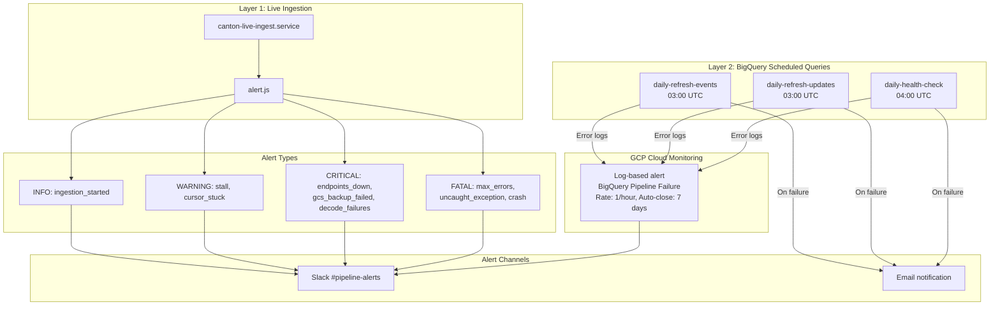
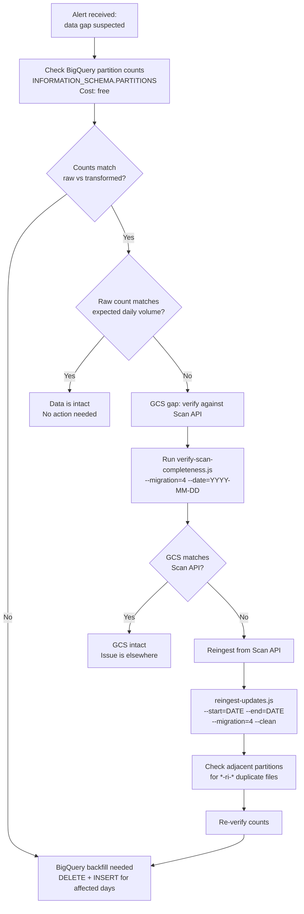

# Data Architecture

## Table of Contents

- [Overview](#overview) — Three-stage pipeline from Scan API to BigQuery views
- [Data Flow](#data-flow) — End-to-end pipeline diagram
- [GCS Layout](#gcs-layout) — Parquet schema, type notes, timestamp and event semantics
- [Live Ingestion](#live-ingestion) — systemd service, environment, deprecated scripts
- [BigQuery Pipeline](#bigquery-pipeline) — Datasets, tables, views, transforms, daily refresh
- [Monitoring and Alerting](#monitoring-and-alerting) — Three-layer monitoring with alert routing
- [Incident Recovery](#incident-recovery) — Decision tree for diagnosing and fixing data gaps
- [Setup Scripts](#setup-scripts) — All SQL scripts and deployment
- [Archive Remediation History](#archive-remediation-history) — Full remediation record and bug fixes
- [Design Decisions](#design-decisions) — Why Parquet, GCS, INSERT NOT EXISTS, bronze-only, etc.

---

## Overview

Canton ledger data flows through a three-stage pipeline:

1. **Ingestion** — Live polling from Canton Scan API → Parquet files on GCS
2. **Transformation** — Raw Parquet → typed BigQuery tables (timestamps, arrays, JSON)
3. **Analytical views** — Bronze views in BigQuery for historical analysis the Scan API cannot serve

---

## Data Authority Contract

> **Parquet files on GCS are the sole authoritative data source.**
>
> All governance, rewards, party state, and analytics **must** be derived from
> Parquet files — either via BigQuery (analytics) or direct Parquet queries.
> Legacy binary formats (JSONL, PBZST) are **deprecated**.

### Enforcement

| Directory | Allowed Operations |
|-----------|-------------------|
| `scripts/ingest/` | Write-only (produces Parquet → GCS) |
| `scripts/bigquery/` | BigQuery DDL, transforms, and scheduled queries |

---

## Data Flow



---

## GCS Layout

```
gs://canton-bucket/
  raw/updates/
    events/migration={0-4}/year=Y/month=M/day=D/*.parquet
    updates/migration={0-4}/year=Y/month=M/day=D/*.parquet
  cursors/
    live-cursor.json
```

- `raw/backfill/` was deleted after full archive remediation
- All data now lives under `raw/updates/` regardless of whether it was
  backfilled or live-ingested

### Parquet Schema

Defined in `scripts/ingest/data-schema.js`:

**Events** (`LEDGER_EVENTS_SCHEMA` / `EVENTS_COLUMNS` — 31 data columns + 3 Hive):
- Identifiers: `event_id`, `update_id`, `contract_id`, `template_id`, `package_name`
- Types: `event_type`, `event_type_original`, `choice`, `consuming`
- Timestamps: `effective_at`, `recorded_at`, `timestamp`, `created_at_ts`
- Parties: `signatories`, `observers`, `acting_parties`, `witness_parties` (arrays)
- Payloads: `payload`, `contract_key`, `exercise_result`, `raw_event`, `trace_context` (JSON strings)
- Reassignment: `source_synchronizer`, `target_synchronizer`, `unassign_id`, `submitter`, `reassignment_counter`
- Partitioning: `migration_id`, plus Hive columns `year`, `month`, `day`

**Updates** (`LEDGER_UPDATES_SCHEMA` / `UPDATES_COLUMNS` — 21 data columns + 3 Hive):
- Identifiers: `update_id`, `update_type`, `workflow_id`, `command_id`
- Timestamps: `record_time`, `effective_at`, `recorded_at`, `timestamp`
- Metadata: `offset`, `event_count`, `root_event_ids`, `kind`
- Reassignment: `source_synchronizer`, `target_synchronizer`, `unassign_id`, `submitter`, `reassignment_counter`
- Payloads: `trace_context`, `update_data` (JSON strings)

### Parquet Type Notes

Raw Parquet files store types that BigQuery cannot auto-resolve:



`SAFE.*` variants return NULL on parse failure instead of killing the query.

### Timestamp Semantics

Two distinct timestamp concepts exist in the data:

| Field | Meaning | Use for |
|-------|---------|---------|
| `effective_at` | When the ledger event actually happened | Partitioning, date queries, time-series |
| `recorded_at` / `timestamp` | When the ingestion batch wrote the record | Debugging ingestion timing only |

These diverge significantly for remediated data: events from 2024-2025 have
`recorded_at` in April–May 2026 (when remediation ran). This is why tables
are partitioned by `DATE(effective_at)`, not `DATE(timestamp)`.

### Event Type Semantics

Events have three types with different payload structures:

| `event_type` | Payload contains | Template fields extractable |
|-------------|-----------------|---------------------------|
| `created` | Contract create arguments | Yes — provider, amount, owner, etc. |
| `archived` | (empty/minimal) | No — only event metadata available |
| `exercised` | Choice arguments (different structure) | No — template-specific fields are NULL |

When querying bronze views for template-specific data (reward amounts, SV weights,
owner parties), always filter `WHERE event_type = 'created'`. Exercised events
appear in the views but their `provider_party`, `reward_amount`, `sv_weight` etc.
will be NULL because the payload contains the choice argument, not the contract fields.

---

## Live Ingestion

**Service**: `canton-live-ingest.service` (systemd on governance-dashboard)

| Setting | Value |
|---------|-------|
| Script | `scripts/ingest/fetch-updates.js` |
| Batch size | 1000 |
| Auto-restart | Yes (on failure + on boot) |
| Shutdown | SIGINT → cursor save |
| Logs | `journalctl -u canton-live-ingest -f` |
| Runbook | `scripts/ingest/LIVE-INGEST-RUNBOOK.sh` |

**Environment files on governance-dashboard**:
- `~/cf-data-platform/scripts/ingest/.env` — Scan API config
- `~/.gcs_hmac_env` — HMAC keys with `export` (for shell/tmux)
- `~/.gcs_hmac_env.systemd` — HMAC keys without `export` (for systemd), plus `ALERT_SLACK_WEBHOOK_URL`

Service file source: `scripts/ingest/canton-live-ingest.service`

### Deprecated Scripts

- `fetch-backfill.js` — Has a systematic data-loss bug: JavaScript `Date`
  truncates Canton's microsecond-precision `record_time` to milliseconds
  during cursor advancement, losing 0.1–0.4% of records per batch boundary.
  See `scripts/ingest/DEPRECATED.md`.

---

## BigQuery Pipeline

**Project**: `governence-483517`

### Datasets

| Dataset | Purpose | Storage cost |
|---------|---------|-------------|
| `raw` | External tables on GCS Parquet | Zero (reads GCS at query time) |
| `transformed` | Materialized tables with proper types + bronze views | ~$0.02/GB/month |

### BigQuery Architecture



### Tables

| Table | Rows | Partitioned by | Clustered by |
|-------|------|---------------|-------------|
| `transformed.events_parsed` | 3.6B+ | `DATE(effective_at)` | `template_id, event_type, migration_id` |
| `transformed.updates_parsed` | 250M+ | `DATE(effective_at)` | `update_type, migration_id` |

Partitioned by `effective_at` (ledger event time), not `timestamp`/`recorded_at`
(ingestion time). The remediation re-ingested all historical data in April–May 2026,
so `timestamp` would clump 697 days of data into a few partitions.

### Bronze Views (deployed in `transformed` dataset)

Only views that provide historical analysis the Scan API cannot serve.
Current-state queries (leaderboards, per-round lookups, featured apps, validator
rankings) are served directly by the Scan API and not replicated here.

These 6 views are the only ones **actually created in BigQuery**. The bronze
scripts (03–08) contain many additional view definitions that were not deployed
— they can be added later if needed.

| View | Source | Purpose |
|------|--------|---------|
| `parsed_app_reward_coupon` | `events_parsed` | Full history of app rewards: provider, round, amount, featured flag |
| `parsed_sv_reward_coupon` | `events_parsed` | SV reward history: SV party, round, weight per round |
| `sv_weight_history` | `events_parsed` | SV weight trajectory over time (created events only) |
| `daily_activity` | `updates_parsed` | Daily transaction counts, event totals, active synchronizers |
| `daily_mint_burn` | `events_parsed` | Daily amulet minting amounts and burn counts |
| `governance_action_summary` | `events_parsed` | Governance proposal trends by action category and type |

Views are zero storage cost — they're saved SQL definitions executed at query time.
Date filters on `effective_at` use partition pruning for efficient scans.

**JSON path notes for governance views**: VoteRequest payloads nest the action
type under category-specific keys, not a flat `$.action.value.tag`:
- `ARC_DsoRules` actions → `$.action.value.dsoAction.tag` (e.g., `SRARC_GrantFeaturedAppRight`)
- `ARC_AmuletRules` actions → `$.action.value.amuletRulesAction.tag` (e.g., `CRARC_SetConfig`)

**Scan API endpoints NOT replicated** (available directly via Scan API;
see `docs/scan-api-reference.pdf` for full API documentation):
- `GET /v0/top-providers-by-app-rewards` — current app reward leaderboard
- `GET /v0/top-validators-by-validator-rewards` — current validator leaderboard
- `GET /v0/top-validators-by-validator-faucets` — validator liveness ranking
- `POST /v0/round-totals` — per-round reward statistics (up to 200 rounds)
- `GET /v0/dso` — current SV list, weights, config
- `GET /v0/featured-apps` — current featured apps
- `GET /v0/admin/sv/voterequests` — active vote requests

### Daily Scheduled Refresh

Two BigQuery scheduled queries run daily at **03:00 UTC** to keep
`events_parsed` and `updates_parsed` current with new data from live ingestion.

**Scripts**: `scripts/bigquery/scheduled/daily-refresh-events.sql` and
`daily-refresh-updates.sql`



**Guarantees**:
- **No duplicates**: `NOT EXISTS` on unique ID + partition date
- **No missing data**: 1-day lookback catches late arrivals; excludes today (incomplete)
- **Crash-safe**: Atomic INSERTs; partial runs leave no corrupt state; next run catches up
- **Auto catch-up**: If pipeline is down for N days, the loop processes all missed days
- **Partition pruning**: `DECLARE`'d date variables are treated as constants by BigQuery

**Cost**: ~$0.16/day (~$4.80/month)
- Events: ~20.5 GB scanned/day
- Updates: ~10.9 GB scanned/day

---

## Monitoring and Alerting

Three layers of monitoring, none depending on VM auth:



| Layer | What it monitors | Alert channel |
|-------|-----------------|---------------|
| Live ingest `alert.js` | GCS ingestion: stalls, crashes, endpoint failures | Slack `#pipeline-alerts` |
| BigQuery daily refresh (2 queries) | Transform + load new data | Email + Slack (via Cloud Monitoring) |
| BigQuery health-check query | Stale data detection | Email + Slack (via Cloud Monitoring) |
| GCP Cloud Monitoring | All BigQuery scheduled query failures | Slack `#pipeline-alerts` |

**Live ingestion alerts** (`scripts/ingest/alert.js`):
- Configured via `ALERT_SLACK_WEBHOOK_URL` env var in `~/.gcs_hmac_env.systemd`
- Alerts: ingestion started (INFO), stall detected (WARNING), cursor stuck (WARNING),
  GCS backup failed (CRITICAL), all endpoints unreachable (CRITICAL), decode failures
  (CRITICAL), max errors reached (FATAL), uncaught exceptions (FATAL)
- Rate limited: 5 min between alerts of same type

**BigQuery health-check** (`scripts/bigquery/scheduled/daily-health-check.sql`):
- Runs at 04:00 UTC (1 hour after daily refresh)
- Checks `INFORMATION_SCHEMA.PARTITIONS` for latest partition dates (free)
- If either table is behind yesterday: `RAISE` with error message → triggers failure alerts
- Email notifications enabled on the scheduled query

**GCP Cloud Monitoring alert** (`BigQuery Pipeline Failure`):
- Log-based alert on: `resource.type="bigquery_resource"` with error status
- Catches ALL BigQuery scheduled query failures (refresh + health check)
- Notification: Slack `#pipeline-alerts` channel
- Rate limit: 1 notification per hour
- Incident auto-close: 7 days

### Failure Scenarios

| Scenario | Detected by | Alert channel | Recovery |
|----------|------------|---------------|----------|
| Live ingest crashes | Layer 1 (alert.js) | Slack (FATAL) | systemd auto-restarts; check logs |
| Live ingest stalls | Layer 1 (alert.js) | Slack (WARNING) | Check Scan API endpoints; restart service |
| All Scan API endpoints down | Layer 1 (alert.js) | Slack (CRITICAL) | Wait for endpoints; service auto-retries |
| Daily refresh fails | Layers 2+3 | Email + Slack | Check BigQuery scheduled query logs; rerun manually |
| Daily refresh succeeds but data stale | Layer 3 (health check) | Email + Slack | Check GCS for missing data; may need reingest |
| BigQuery itself down | Layer 3 (Cloud Monitoring) | Slack | Wait for BigQuery; refresh will auto-catch-up |
| Governance-dashboard VM down | Layer 3 (health check next day) | Email + Slack | Restart VM; ingest auto-resumes from cursor |

### Configuration Reference

**Environment variables** (governance-dashboard, `~/.gcs_hmac_env.systemd`):

| Variable | Purpose | Required |
|----------|---------|----------|
| `ALERT_SLACK_WEBHOOK_URL` | Slack incoming webhook URL | Yes (for Slack alerts) |
| `ALERT_RATE_LIMIT_MS` | Min interval between same-type alerts (default: 300000 = 5 min) | No |
| `ALERT_HOSTNAME` | Host identifier in alert messages (default: hostname) | No |

**BigQuery scheduled queries**:

| Query | Schedule | Alerts on failure |
|-------|----------|-------------------|
| `daily-refresh-events-parsed` | 03:00 UTC | Email + Slack (Cloud Monitoring) |
| `daily-refresh-updates-parsed` | 03:00 UTC | Email + Slack (Cloud Monitoring) |
| `daily-health-check-pipeline` | 04:00 UTC | Email + Slack (Cloud Monitoring) |

---

## Incident Recovery



**Important notes for reingest**:
- `--end` is **inclusive** (not exclusive). `--end=2026-05-21` includes May 21.
- `--clean` deletes existing data for the date range before re-ingesting.
- Reingest can spill boundary records into adjacent partitions (records with
  `effective_at` on day N-1 but `record_time` on day N). After any reingest,
  check adjacent day partitions for `*-ri-*` files and delete them.
- Use `--max-old-space-size=8192` for days with high volume to avoid OOM.

---

## Setup Scripts

**`scripts/bigquery/`**:

| Script | Purpose |
|--------|---------|
| `deploy.sh` | Parameterized deployment of bronze/silver layers (substitutes `${PROJECT_ID}` / `${BUCKET_NAME}`) |

**Bronze layer** (`bronze/`):

| Script | Purpose |
|--------|---------|
| `01-create-external-tables.sql` | External tables on GCS Parquet (`raw.events`, `raw.updates`) |
| `02-transform-raw-data.sql` | Full load: parse timestamps, extract arrays, parse JSON → `transformed.*_parsed` |
| `03-parse-events-by-template.sql` | Views per template (Amulet, ValidatorLicense, rewards, rounds, etc.) |
| `04-parse-updates.sql` | Transaction and reassignment views, daily activity |
| `05-governance-tables.sql` | DsoRules, VoteRequest, Confirmation, ElectionRequest views |
| `06-rewards-tables.sql` | Reward summary, leaderboards, SV weight history views |
| `07-amulet-tables.sql` | Amulet creation/archive/supply/transfer views |
| `08-exercised-choices.sql` | Exercised event views (choices, transfers, governance actions) |
| `09-verify-transforms.sql` | Row count, type, array, and data-loss verification queries |

**Scheduled queries** (`scheduled/`):

| Script | Purpose |
|--------|---------|
| `daily-refresh-events.sql` | Incremental INSERT NOT EXISTS for events_parsed |
| `daily-refresh-updates.sql` | Incremental INSERT NOT EXISTS for updates_parsed |
| `daily-health-check.sql` | Stale data detection — RAISE on failure → triggers alerts |

**Silver layer** (`silver/`) — not yet deployed, available for future use:

| Script | Purpose |
|--------|---------|
| `01-amulet-silver.sql` | Amulet contracts, archives, locked amulets, lifecycle, daily supply |
| `02-governance-silver.sql` | Vote requests, votes, DSO rules state, SV membership |
| `03-rewards-silver.sql` | Reward coupons (app/SV/validator), unified rewards, leaderboard |
| `04-validators-silver.sql` | Licenses, rights, faucet coupons, liveness, lifecycle |
| `05-network-silver.sql` | Traffic, mining rounds, ANS entries, SV nodes, price votes |
| `06-exercised-silver.sql` | Choices, transfers, governance actions, reward claims |

### Deployment (initial setup)

```bash
# Dry run (prints rendered SQL)
PROJECT_ID=governence-483517 BUCKET_NAME=canton-bucket DRY_RUN=1 ./scripts/bigquery/deploy.sh

# Deploy bronze layer
PROJECT_ID=governence-483517 BUCKET_NAME=canton-bucket ./scripts/bigquery/deploy.sh bronze
```

### BigQuery Cost Summary

| Operation | Cost |
|-----------|------|
| Initial bulk load (one-time) | ~$72 (events $47, updates $25) |
| Daily incremental refresh | ~$0.16/day ($4.80/month) |
| Bronze view queries | Per-query (partition-pruned, typically <$1) |
| Storage (transformed tables) | ~$0.02/GB/month |

---

## GCS Operations

All GCS operations use `@google-cloud/storage` SDK with Application Default
Credentials (ADC). No script depends on gsutil.

| Script | GCS Usage |
|--------|-----------|
| `verify-scan-completeness.js` | `listExistingGlobs()` via SDK |
| `gcs-scanner.js` | Walks Hive partitions via SDK |
| `gcs-preflight.js` | Read/write checks via SDK |
| `fetch-updates.js` | Writes Parquet via SDK |

---

## Archive Remediation History

The full archive (2024-06-24 → 2026-05-17) was re-ingested via
`reingest-updates.js` to fix the `fetch-backfill.js` cursor bug:

| Migration | Date Range | Days | Records |
|-----------|-----------|------|---------|
| M0 | 2024-06-24 → 2024-10-16 | 115 | 2,746,625 |
| M1 | 2024-10-16 → 2024-12-11 | 57 | 1,655,530 |
| M2 | 2024-12-11 → 2025-06-25 | 197 | 12,584,874 |
| M3 | 2025-06-25 → 2025-12-10 | 169 | 77,849,404 |
| M4 | 2025-12-10 → 2026-05-17 | 159 | 153,900,412 |
| **Total** | | **697** | **248,736,845** |

15-day random sample verified: 15/15 days MATCH Scan API. Zero gaps, zero duplicates.

### Bugs Fixed During Remediation

| Bug | Fix |
|-----|-----|
| Backfill cursor truncates microseconds | Deprecated `fetch-backfill.js`, used `reingest-updates.js` |
| `effective_at` filter dropped stragglers | Removed from `processAndWrite` |
| Migration ID override on boundary days | Added `migration_id` filter |
| gsutil reauth failures | Replaced all gsutil with `@google-cloud/storage` SDK |
| DuckDB timeout on large days | Configurable via `VSC_DUCKDB_TIMEOUT_MS` |
| Live ingest file proliferation | `BATCH_SIZE` 100 → 1000 |
| GCS scanner cursor jump on restart | Clamp inferred timestamp to now; refuse future auto-sync |

### May 20 Cursor Jump Incident

On 2026-05-20 at 00:18 UTC, a `systemctl restart` triggered the GCS scanner
to infer a future timestamp (`T23:54:59.999Z`) from the Hive partition path
`day=20`. The scanner's fallback uses end-of-day-minus-5-min when Parquet
filenames lack timestamps (live ingest files use hex IDs, not timestamps).
The auto-sync logic then advanced the cursor ~23 hours ahead, skipping 97%
of May 20's data.

**Root cause**: `gcs-scanner.js` `extractTimestampFromGCSFiles()` returned
a future timestamp from the partition date, and `fetch-updates.js` auto-synced
the cursor to it without checking if the time was in the future.

**Fix** (commit `fd7f2b4`):
1. `gcs-scanner.js`: Clamp fallback timestamp to `now - 5min`
2. `fetch-updates.js`: Refuse auto-sync when inferred time is in the future
3. `fetch-updates.js`: Same clamp in local `findLatestFromRawData()`

**Recovery**: May 20 and 21 re-ingested from Scan API via `reingest-updates.js`,
verified against Scan API (508,576 and 453,970 updates respectively), BigQuery
backfilled manually. All 26 days in May verified: 100% match between GCS and
BigQuery transformed tables.

---

## Design Decisions

### Why Parquet?

1. **Direct SQL** — BigQuery reads Parquet natively via external tables
2. **Column pruning** — Only reads columns needed for each query
3. **Predicate pushdown** — Filters applied at file level
4. **Schema evolution** — Handles schema changes across migrations

### Why GCS as Source of Truth?

1. **Durability** — Cloud storage with redundancy, not a single VM disk
2. **Shared access** — BigQuery external tables read directly from GCS
3. **Live ingest** — systemd service writes continuously, BigQuery picks up new files
4. **Cost** — External tables avoid BigQuery storage costs for raw data

**Note**: BigQuery caches external table file metadata for up to several hours.
Newly written Parquet files in GCS are not immediately visible to queries against
`raw.events` / `raw.updates`. This is fine for the daily scheduled refresh (runs
at 03:00 UTC, hours after files are written), but matters for ad-hoc queries
expecting real-time data.

### Why Two BigQuery Datasets?

1. **`raw`** — Zero-cost external tables; always current as files land in GCS
2. **`transformed`** — Fixes Parquet type mismatches; query-ready with proper types, hosts bronze views

### Why INSERT NOT EXISTS over MERGE for Daily Refresh?

MERGE with partition pruning scans ~270 GB/day ($1.35/day).
INSERT NOT EXISTS with explicit date constants scans ~31 GB/day ($0.16/day).
The 8x cost difference comes from BigQuery's ability to push constant date
filters into partition pruning more efficiently than dynamic MERGE ON clauses.

### Why Only Bronze Views (No Silver Materialized Tables)?

Silver tables (pre-joined, clustered materialized tables) add storage cost
and require their own refresh schedule. The current bronze views are sufficient:
they query `events_parsed` directly with partition pruning, and most analytical
questions can be answered with ad-hoc SQL. Silver scripts exist in `scripts/bigquery/silver/`
for future deployment if query patterns justify materialization.

### Why Not Replicate Scan API Data in BigQuery?

The Scan API already serves current-state queries: leaderboards, per-round
stats, featured apps, validator rankings, active vote requests. Replicating
these in BigQuery wastes compute and creates a stale-data risk. BigQuery
views focus exclusively on historical analysis the API cannot serve:
time-series trends, cross-period aggregations, SV weight trajectories,
and governance action patterns over the full 2-year archive.
