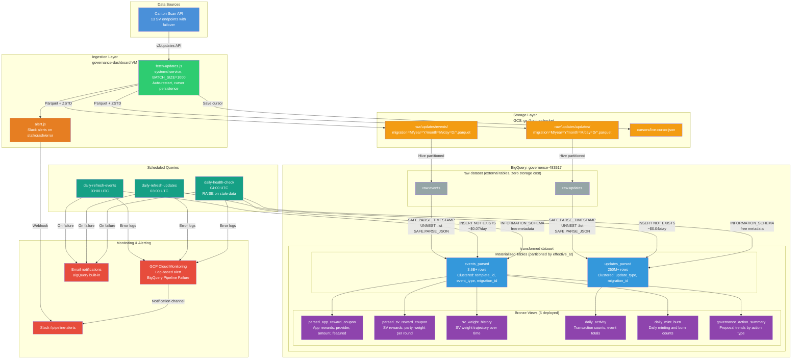

```mermaid
graph TD
    subgraph "Data Sources"
        SCAN[Canton Scan API<br/>13 SV endpoints with failover]
    end

    subgraph "Ingestion Layer<br/>governance-dashboard VM"
        INGEST[fetch-updates.js<br/>systemd service, BATCH_SIZE=1000<br/>Auto-restart, cursor persistence]
        ALERT[alert.js<br/>Slack alerts on stall/crash/error]
        INGEST --> ALERT
    end

    subgraph "Storage Layer<br/>GCS: gs://canton-bucket"
        GCS_EVENTS[raw/updates/events/<br/>migration=M/year=Y/month=M/day=D/*.parquet]
        GCS_UPDATES[raw/updates/updates/<br/>migration=M/year=Y/month=M/day=D/*.parquet]
        CURSOR[cursors/live-cursor.json]
    end

    subgraph "BigQuery: governence-483517"
        subgraph "raw dataset (external tables, zero storage cost)"
            RAW_E[raw.events]
            RAW_U[raw.updates]
        end

        subgraph "transformed dataset"
            subgraph "Materialized Tables (partitioned by effective_at)"
                EVENTS[events_parsed<br/>3.6B+ rows<br/>Clustered: template_id, event_type, migration_id]
                UPDATES[updates_parsed<br/>250M+ rows<br/>Clustered: update_type, migration_id]
            end

            subgraph "Bronze Views (6 deployed)"
                V1[parsed_app_reward_coupon<br/>App rewards: provider, amount, featured]
                V2[parsed_sv_reward_coupon<br/>SV rewards: party, weight per round]
                V3[sv_weight_history<br/>SV weight trajectory over time]
                V4[daily_activity<br/>Transaction counts, event totals]
                V5[daily_mint_burn<br/>Daily minting and burn counts]
                V6[governance_action_summary<br/>Proposal trends by action type]
            end
        end
    end

    subgraph "Scheduled Queries"
        REFRESH_E[daily-refresh-events<br/>03:00 UTC]
        REFRESH_U[daily-refresh-updates<br/>03:00 UTC]
        HEALTH[daily-health-check<br/>04:00 UTC<br/>RAISE on stale data]
    end

    subgraph "Monitoring & Alerting"
        SLACK[Slack #pipeline-alerts]
        CLOUD_MON[GCP Cloud Monitoring<br/>Log-based alert<br/>BigQuery Pipeline Failure]
        EMAIL[Email notifications<br/>BigQuery built-in]
    end

    SCAN -->|v2/updates API| INGEST
    INGEST -->|Parquet + ZSTD| GCS_EVENTS
    INGEST -->|Parquet + ZSTD| GCS_UPDATES
    INGEST -->|Save cursor| CURSOR

    GCS_EVENTS -->|Hive partitioned| RAW_E
    GCS_UPDATES -->|Hive partitioned| RAW_U

    RAW_E -->|SAFE.PARSE_TIMESTAMP<br/>UNNEST .list<br/>SAFE.PARSE_JSON| EVENTS
    RAW_U -->|SAFE.PARSE_TIMESTAMP<br/>UNNEST .list<br/>SAFE.PARSE_JSON| UPDATES

    EVENTS --> V1
    EVENTS --> V2
    EVENTS --> V3
    UPDATES --> V4
    EVENTS --> V5
    EVENTS --> V6

    REFRESH_E -->|INSERT NOT EXISTS<br/>~$0.07/day| EVENTS
    REFRESH_U -->|INSERT NOT EXISTS<br/>~$0.04/day| UPDATES
    HEALTH -->|INFORMATION_SCHEMA<br/>free metadata| EVENTS
    HEALTH -->|INFORMATION_SCHEMA<br/>free metadata| UPDATES

    ALERT -->|Webhook| SLACK
    CLOUD_MON -->|Notification channel| SLACK
    REFRESH_E -->|On failure| EMAIL
    REFRESH_U -->|On failure| EMAIL
    HEALTH -->|On failure| EMAIL
    REFRESH_E -->|Error logs| CLOUD_MON
    REFRESH_U -->|Error logs| CLOUD_MON
    HEALTH -->|Error logs| CLOUD_MON

    style SCAN fill:#4a90d9,color:#fff
    style INGEST fill:#2ecc71,color:#fff
    style ALERT fill:#e67e22,color:#fff
    style GCS_EVENTS fill:#f39c12,color:#fff
    style GCS_UPDATES fill:#f39c12,color:#fff
    style CURSOR fill:#f39c12,color:#fff
    style RAW_E fill:#95a5a6,color:#fff
    style RAW_U fill:#95a5a6,color:#fff
    style EVENTS fill:#3498db,color:#fff
    style UPDATES fill:#3498db,color:#fff
    style V1 fill:#8e44ad,color:#fff
    style V2 fill:#8e44ad,color:#fff
    style V3 fill:#8e44ad,color:#fff
    style V4 fill:#8e44ad,color:#fff
    style V5 fill:#8e44ad,color:#fff
    style V6 fill:#8e44ad,color:#fff
    style REFRESH_E fill:#16a085,color:#fff
    style REFRESH_U fill:#16a085,color:#fff
    style HEALTH fill:#16a085,color:#fff
    style SLACK fill:#e74c3c,color:#fff
    style CLOUD_MON fill:#e74c3c,color:#fff
    style EMAIL fill:#e74c3c,color:#fff
```
