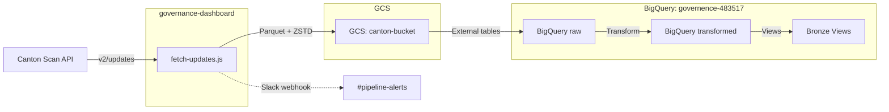
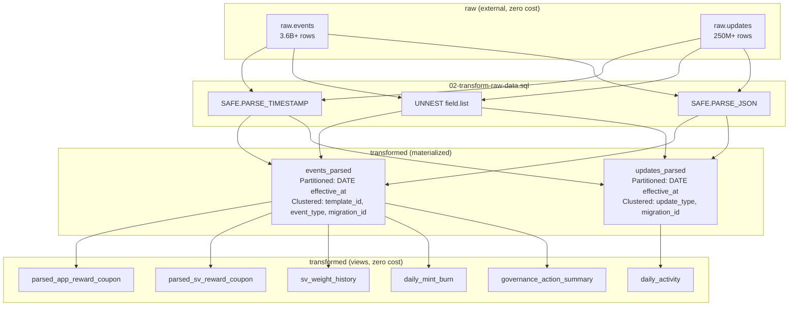
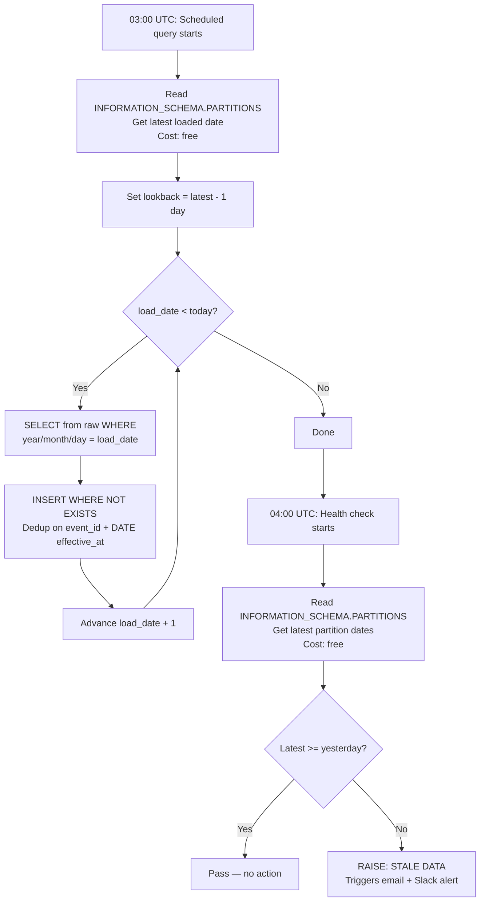
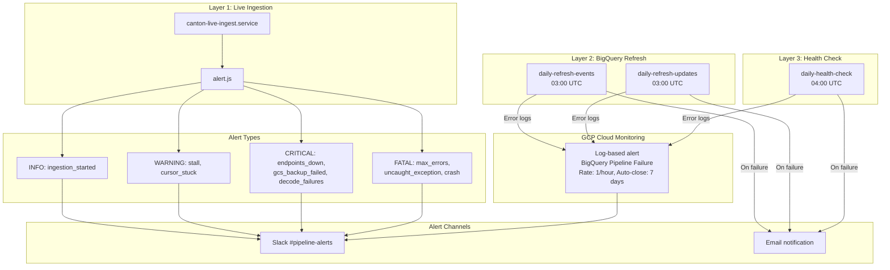
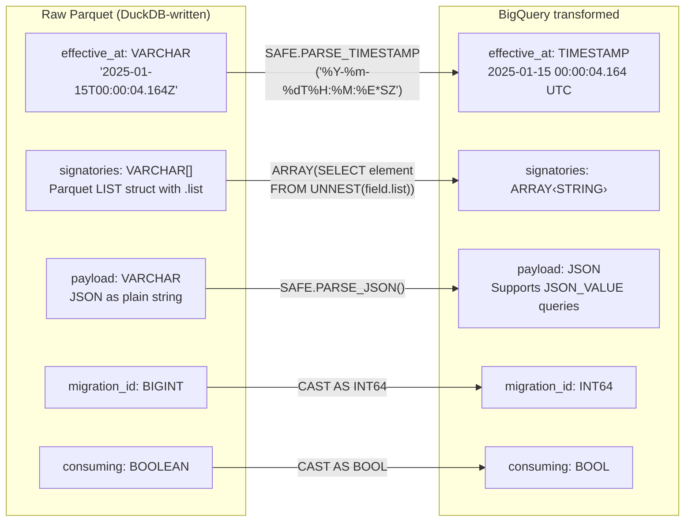
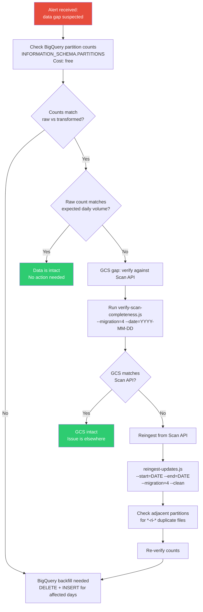

# Data Pipeline Diagrams

## Table of Contents

1. [End-to-End Pipeline Flow](#1-end-to-end-pipeline-flow) — Complete data journey from Canton Scan API through GCS to BigQuery tables and views
2. [BigQuery Dataset Architecture](#2-bigquery-dataset-architecture) — How raw, transformed, and view layers relate within BigQuery
3. [Daily Refresh Process](#3-daily-refresh-process) — Step-by-step logic of the scheduled incremental load at 03:00 UTC
4. [Monitoring & Alerting](#4-monitoring--alerting) — Three-layer monitoring system with alert routing to Slack and email
5. [Data Type Transform](#5-data-type-transform) — How raw Parquet types are converted to BigQuery-native types
6. [Incident Recovery Workflow](#6-incident-recovery-workflow) — Steps to diagnose and recover from data gaps

---

## 1. End-to-End Pipeline Flow

## 2. BigQuery Dataset Architecture

## 3. Daily Refresh Process

## 4. Monitoring & Alerting

## 5. Data Type Transform

## 6. Incident Recovery Workflow

